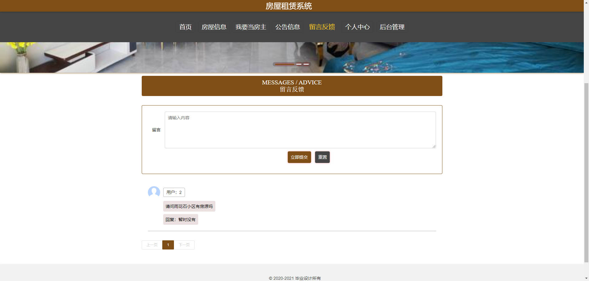

# 基于Springboot的房屋租赁系统

## Springboot-0008


## 技术栈

Springboot mybatisplus vue mysql maven


## 数据库表(18张)


## 功能介绍

```properties
管理员
1、开发实现房屋租赁系统的整个系统程序； 
2、系统管理：个人中心、房屋信息管理、预约看房管理、合同信息管理、房屋报修管理、维修处理管理、房屋评价管理等模块的查看及相应操作；
3、房屋信息管理：实现房屋信息信息的查看及在线发布相应操作；
4、基础数据管理：实现房屋信息信息的添加、修改及删除等操作，并且根据需求进行房源信息的查看及发布预订等相应操作。
```


## 图片

### 前台




### 后台


## 访问路径

### 前台

```properties
http://localhost:8080/springboot08hr3/front/pages/login/login.html

账号 2
密码 2
```

### 后台

```properties
http://localhost:8080/springboot08hr3/admin/dist/index.html#/login

账号 abo
密码 abo
```


## 功能图


## 文档目录


## 打赏或交流


